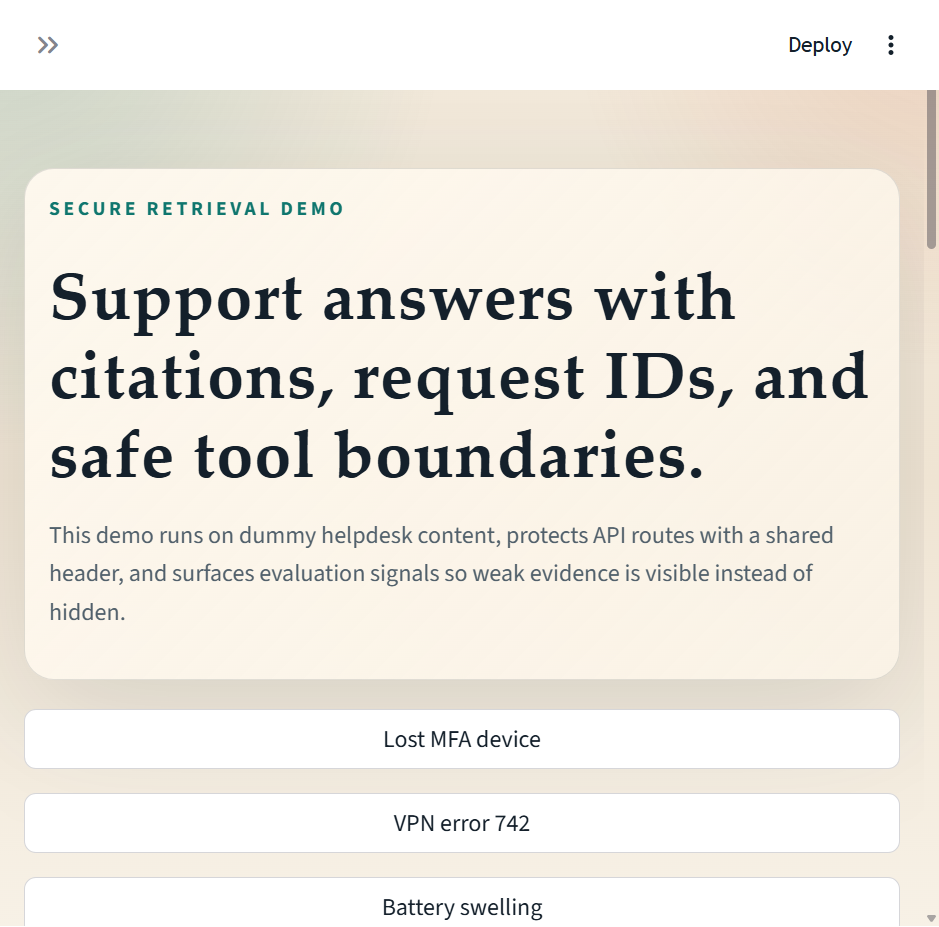
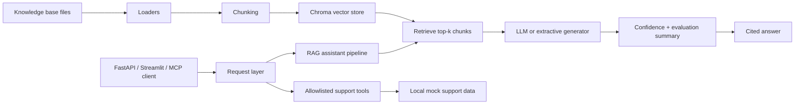

# Secure RAG Support Assistant

A portfolio-grade retrieval augmented generation system for IT and support operations. It ingests a private knowledge base, returns grounded answers with citations, exposes safe support tools through FastAPI and MCP, and ships with a benchmarkable local demo.



## Why This Repo Stands Out

- End-to-end AI system: ingestion, retrieval, answer generation, evaluation, API, UI, and MCP tooling in one repo.
- Secure-by-default demo: protected API routes, request IDs, allowlisted tools, and weak-evidence fallback behavior.
- Runnable without paid services: local extractive mode works with the included dummy knowledge base and mock support data.
- Honest evaluation story: the repo includes a committed benchmark snapshot instead of relying on screenshots alone.
- GitHub-ready engineering signal: Docker support, tests, and CI are included so the project feels production-minded.

## Demo Artifacts

- [Architecture walkthrough](docs/architecture.md)
- [HTTP API examples](examples/api.http)
- [Evaluation summary](outputs/reports/evaluation_summary.md)
- [Raw evaluation snapshot](outputs/reports/evaluation_snapshot.json)
- [Streamlit screenshot](outputs/screenshots/streamlit-demo.png)

## What It Does

- Indexes Markdown, TXT, CSV, and PDF support documents into Chroma.
- Retrieves relevant passages and returns cited answers with confidence and lightweight quality metrics.
- Exposes ingestion, question answering, evaluation, and support-tool routes through FastAPI.
- Provides a Streamlit UI for recruiter-friendly demos and a FastMCP server for allowlisted tool access.
- Evaluates answer quality on a small benchmark set stored in `data/eval/questions.json`.

## Current Benchmark Snapshot

Run on the bundled demo corpus and evaluation set:

| Metric | Value |
| --- | ---: |
| Sample count | 6 |
| Average relevance | 0.5669 |
| Average faithfulness | 0.7406 |
| Average retrieval hit | 1.0000 |

The current snapshot shows strong retrieval coverage and visible room to improve answer compression in extractive mode. That is the right tradeoff for a showcase repo: retrieval is grounded, limitations are measurable, and the next engineering steps are clear.

## Architecture



See [docs/architecture.md](docs/architecture.md) for the component breakdown, request flow, and security boundaries.

## Repository Layout

```text
.
├── .github/workflows/        CI checks
├── .streamlit/config.toml    Demo-friendly Streamlit config
├── app/                      FastAPI app, RAG pipeline, MCP server, Streamlit UI
├── data/                     Evaluation set and mock support data
├── docs/                     Architecture documentation
├── examples/                 Ready-to-run API examples
├── knowledge_base/           Demo support documents
├── outputs/                  Screenshot and benchmark artifacts
├── scripts/                  CLI entrypoints
├── tests/                    Focused unit tests
├── Dockerfile                Container runtime
├── requirements.txt          Python dependencies
└── .env.example              Safe local config template
```

## Quick Start

### 1. Create a virtual environment

```bash
python -m venv .venv
.venv\Scripts\activate
pip install -r requirements.txt
```

Python 3.11 is the safest target for local runs and matches the Docker image.

### 2. Configure local settings

```bash
copy .env.example .env
```

The repo defaults to extractive mode. You only need a real OpenAI key if you set `ENABLE_LLM=true`.

### 3. Build the vector index

```bash
python scripts/ingest_kb.py
```

### 4. Run the API

```bash
uvicorn app.main:app --reload
```

### 5. Try the API

Use [examples/api.http](examples/api.http) or this Windows `curl` example:

```bash
curl -X POST http://127.0.0.1:8000/api/v1/ask ^
  -H "X-API-Key: demo-support-token" ^
  -H "Content-Type: application/json" ^
  -d "{\"question\": \"How do I reset MFA after losing my phone?\"}"
```

### 6. Run the demo UI

```bash
streamlit run app/ui/streamlit_app.py
```

### 7. Run the benchmark

```bash
python scripts/run_eval.py
```

### 8. Run the MCP server

```bash
python -m app.mcp_server
```

## API Surface

- `GET /health`
- `POST /api/v1/ingest`
- `POST /api/v1/ask`
- `POST /api/v1/evaluate`
- `GET /api/v1/tools/ticket/{ticket_id}`
- `GET /api/v1/tools/error/{error_code}`
- `POST /api/v1/tools/follow-up`

## Security Posture

- API routes require an `X-API-Key` header in demo mode.
- Every response includes an `X-Request-ID` header for traceability.
- Tool access is explicit and allowlisted.
- Follow-up note creation is constrained to local mock data.
- Low-confidence answers fall back to a safer response instead of overclaiming.
- Dummy config and mock data are included so the project is demoable without exposing real support systems.

## Why Employers Care About This Repo

- It shows system design, not just model usage.
- It demonstrates evaluation and safety thinking, not just a chatbot UI.
- It proves the work can be packaged as an API, a UI, scripts, tests, and deployable infrastructure.

## Next Improvements

- Improve extractive answer compression so CSV-backed answers cite only the most relevant rows.
- Add tracing for ingest, retrieval, and generation latency.
- Add role-based auth or signed service tokens instead of the shared demo token.
- Swap the local evaluation heuristics for a stronger judge or human review workflow when moving past the demo stage.

