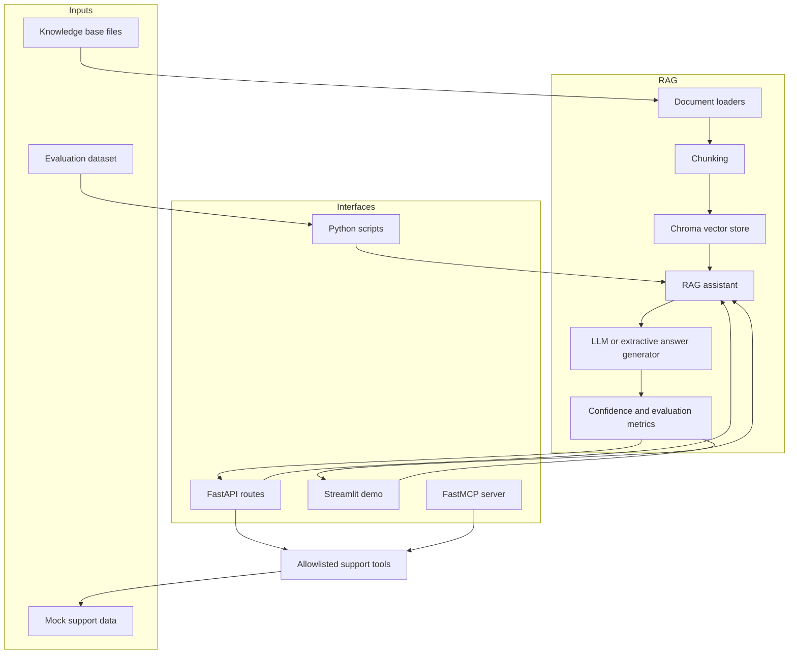

# Architecture

This repo is designed to show more than a single prompt-response loop. It demonstrates how retrieval, security boundaries, evaluation, tooling, and developer experience fit together in a realistic AI support assistant.

## Design Goals

- Keep the demo runnable with local data and no paid services.
- Make retrieval quality inspectable through citations and evaluation output.
- Keep tool usage constrained and explicit.
- Expose the same core pipeline through API, UI, scripts, and MCP.

## System Diagram

## Component Breakdown

| Area | Main files | Responsibility |
| --- | --- | --- |
| API | `app/api/routes.py`, `app/main.py` | Serves health, ingest, ask, evaluate, and support-tool routes. |
| Config and security | `app/config.py`, `app/security.py`, `app/observability.py` | Loads environment settings, enforces API keys, and adds request tracing. |
| Retrieval pipeline | `app/rag/loaders.py`, `app/rag/chunking.py`, `app/rag/vector_store.py`, `app/rag/pipeline.py` | Loads documents, creates chunks, stores embeddings, retrieves evidence, and assembles answers. |
| Generation | `app/rag/generation.py` | Produces answers in either local extractive mode or optional OpenAI-backed mode. |
| Evaluation | `app/eval/metrics.py`, `app/eval/runner.py` | Scores relevance, faithfulness, and retrieval hit rate on a benchmark set. |
| Safe tools | `app/tools/support_tools.py`, `app/mcp_server.py` | Exposes allowlisted support operations over API and MCP using mock data. |
| Demo UI | `app/ui/streamlit_app.py`, `app/ui/styles.css` | Provides a recruiter-friendly interface with grounded-answer and tool-sandbox views. |

## Request Flow

### Ingestion flow

1. `scripts/ingest_kb.py` or `POST /api/v1/ingest` loads the knowledge base directory.
2. Files are normalized into `SourceDocument` objects.
3. Documents are split into overlapping line-based chunks.
4. Chunk text and metadata are written to Chroma.

### Question-answering flow

1. A user asks a question through FastAPI or Streamlit.
2. The vector store retrieves the top-k nearest chunks.
3. The pipeline reselects the most relevant chunks for generation.
4. The generator returns a cited answer.
5. The pipeline attaches confidence and evaluation signals before returning the response.

### Tooling flow

1. The assistant never gets arbitrary system access.
2. Support operations are limited to explicit allowlisted functions.
3. Tool reads and writes stay inside `data/mock/` so the demo is safe and repeatable.
4. The same tool boundary is exposed through FastAPI and MCP.

## Security Boundaries

- API routes are protected with a shared demo token by default.
- Request IDs are attached to responses so runs are traceable.
- Tool inputs are validated through Pydantic request models.
- Weak-evidence answers are surfaced as weak instead of silently overclaiming.
- The repo uses dummy data and non-secret local config so it can be shared safely.

## Extension Paths

- Replace extractive generation with stronger answer compression or structured synthesis.
- Replace demo auth with signed service tokens or an identity provider.
- Swap Chroma for a production vector backend such as pgvector if needed.
- Add tracing and latency dashboards around ingest, retrieval, and generation.